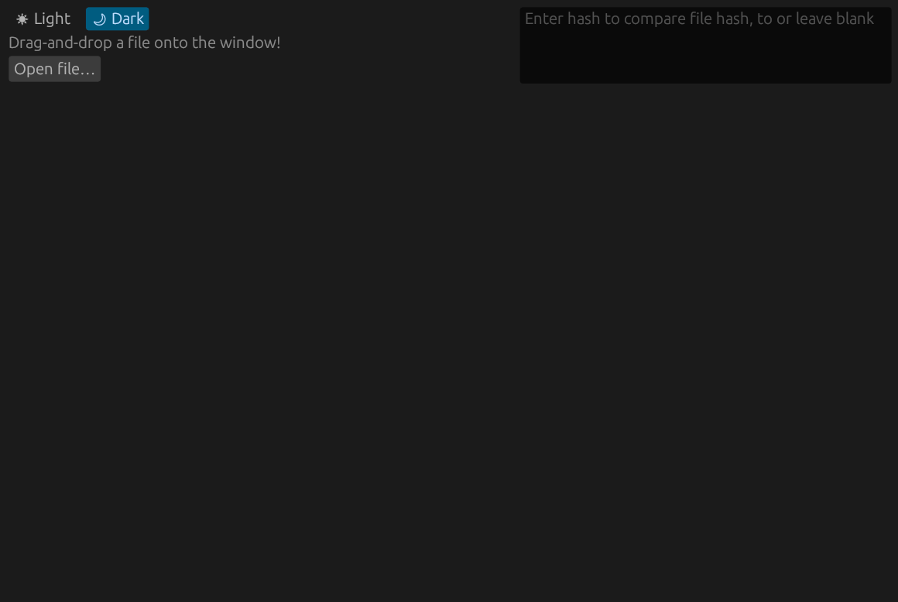

# fash

fash is a cross-platform GUI-app for computing hashes of files and comparing them to supplied hashes. 

  
  

    <i>Demo GIF where file is dragged and dropped.</i>
  

Written in Rust, using the library <a href="https://github.com/emilk/egui">egui</a> for the GUI, and libraries from <a href="https://github.com/RustCrypto">RustCrypto</a> for computing hashes.

fash can compute hashes using the algorithms SHA256, SHA1 and MD5.

# License

fash is dual-licensed under either

* MIT License (LICENSE-MIT or http://opensource.org/licenses/MIT)
* Apache License, Version 2.0 (LICENSE-APACHE or http://www.apache.org/licenses/LICENSE-2.0)

at your option. 